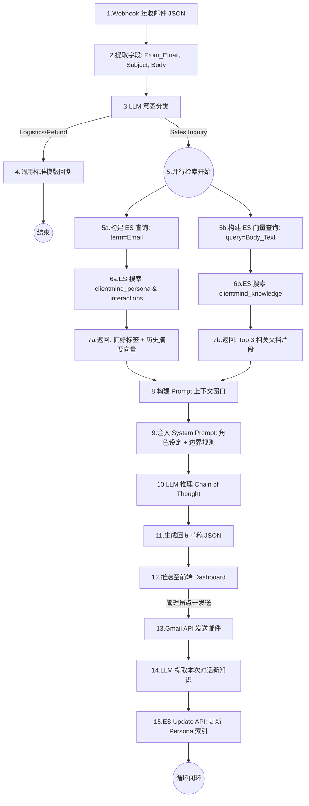

# ClientMind AI Agent 产品需求文档 (PRD)

**项目名称**：ClientMind AI Agent  
**版本**：v1.6 (最终全量执行版 - The Atomic Edition)  
**状态**：待开发 (Ready for Dev)  
**定位**：基于 Elasticsearch “双路 RAG (Dual-RAG)” 架构的跨境电商“销冠级”销售智能体。

---

## 1. 项目背景与目标 (Background & Goals)

- **核心痛点**：
  - **记忆缺失**：传统 AI 无法识别老客的尺码反馈、风格偏好，导致重复询问，体验差。
  - **知识幻觉**：通用大模型不了解店铺实时的尺码表、退换货政策，容易胡乱承诺。
- **核心目标**：
  - **验证技术**：展示 Elasticsearch 作为 Agent 的“海马体（记忆）”和“皮层（知识）”的统一存储能力。
  - **商业闭环**：实现“感知用户 -> 检索记忆+知识 -> 策略推理 -> 促成转化 -> 记忆进化”的完整闭环。
  - **黑客松演示**：通过控制台直观展示数据流转，体现“双路检索”的技术硬实力。

---

## 2. 产品定义与功能边界 (Definition & Scope)

### 2.1 记忆深度：隐私与服务的边界 (Memory System)

系统仅记录与“提升转化”和“服务体验”强相关的结构化/非结构化数据。

| 记忆分类     | 记录项 (Do's)                                  | 展示标签颜色       | 理由                       |
| :----------- | :--------------------------------------------- | :----------------- | :------------------------- |
| **关键警告** | 历史尺码反馈（偏紧/偏大）、过敏史（羊毛/化纤） | **红色 (#EF4444)** | 避免重复错误，确保穿着舒适 |
| **销售机会** | 风格偏好（极简/复古）、色系偏好（海军蓝）      | **绿色 (#10B981)** | 精准推荐，提高转化率       |
| **基础画像** | VIP等级、购买频率、性别、地区                  | **蓝色 (#3B82F6)** | 身份识别，提供差异化服务   |
| **历史脉络** | 历史咨询主题摘要、曾遭遇的物流问题             | **灰色 (#6B7280)** | 掌握上下文，体现服务连续性 |

### 2.2 知识库管理：动态知识引擎 (Knowledge Base System)

**功能定义**：
Agent 的“外挂知识库”，用于存储店铺的标准化文档，确保回复的准确性。区别于用户记忆，这是所有用户通用的静态事实数据。

- **支持格式**：PDF (尺码表、画册), DOCX (品牌故事、FAQ), TXT (政策文本)。
- **核心能力**：
  - **自动化 ETL**：上传即触发 Elasticsearch Ingest Pipeline，自动完成文本提取 -> 分块(Chunking) -> 向量化(Embedding) -> 索引。
  - **语义检索**：支持自然语言提问（如“M码胸围是多少”）并精准定位到文档的具体段落。

---

## 3. 用户旅程 (User Journey Map)

本旅程覆盖了管理员配置与Agent 运行的全生命周期。

**阶段一：初始化配置 (Admin Setup)**

- **店铺接入**：管理员进入 [Settings]，配置 相关的“人设”与“权限”配置。
- **知识注入**：管理员进入 [Knowledge Base]，上传《2024夏季尺码表.pdf》和《退换货政策.docx》。
- **系统就绪**：系统提示“Documents Indexed Successfully”，知识库构建完成。

**阶段二：实时交互 (Agent Runtime)**

- **邮件接收**：老客 John 发来邮件：“我上次买的 M 码衬衫有点紧，这次想买蓝色风衣，推荐什么码？”
- **双路唤醒**：
  - **路 A (Memory)**：ES 检索到 John 曾反馈“M 码胸围偏小 2cm”。
  - **路 B (Knowledge)**：ES 检索到《尺码表》中风衣 L 码的详细数据。
- **推理决策**：Agent 思考：“用户嫌 M 紧 + 尺码表显示风衣偏修身 -> 必须推荐 L 码”。
- **回复生成**：Agent 生成草稿：“John 您好，鉴于您上次反馈衬衫 M 码偏紧，且这款风衣版型修身，强烈建议您选择 L 码...”

**阶段三：进化闭环 (Evolution)**

- **人工确认**：管理员在控制台点击 [Approve] 发送邮件。
- **记忆写入**：系统自动提取“用户偏好风衣”、“确认 L 码”等新标签，更新至 Elasticsearch 的 John 画像中。

---

## 4. 系统流程图 (Atomic Level Flowchart)

本流程图拆解至不可再分的原子操作节点，用于指导后端代码编写。

---

## 5. 控制台 UI 交互设计 (The Agent Console)

控制台采用经典的后台管理布局，分为左侧导航菜单和右侧核心功能区。

### 5.1 全局导航栏 (Sidebar Navigation)

- **Logo/Name**: ClientMind
- **Menu Items**:
  - **Dashboard** (控制台): 默认首页，核心工作台。
  - **Knowledge Base** (资料库管理): 管理外部文档。
  - **Settings** (设置): 店铺人设与系统配置。
  - _(Reserved)_ **Data Homepage**: 预留数据首页。

### 5.2 Tab 1: [Dashboard] - 核心工作台 (三面板布局)

**路由**: `/activity/dashboard`
**功能**: 销售与客服人员的核心操作界面，实时处理邮件与生成回复。

**左面板：感知中心 (Perception Hub)**

- **功能**：邮件流的实时监控与选择。
- **列表项字段**：
  - Avatar: 用户首字母头像 (带 VIP 颜色边框)。
  - Name & Email: John Doe (john@example.com)。
  - Intent Tag: [Sales Inquiry] (高亮), [Support]。
  - Snippet: 邮件前 30 个字符。
  - Time: 10 min ago.
- **交互逻辑**：
  - 点击：选中某邮件，触发面板 2 和 面板 3 的刷新（Loading 状态 -> 数据展示）。
  - 筛选：顶部提供“仅显示咨询”、“仅显示未处理”的 Filter 按钮。

**中面板：大脑可视化 (Memory Brain)**

- **功能**：展示 ES 双路检索的结果，证明“我真的查了数据库”。
- **区域 A: 用户画像 (Persona Memory)**
  - 展示：云状标签集。
  - 交互：
    - 红色标签 #M码偏紧：悬停显示“来源：2023-10-15 邮件”。
    - 绿色标签 #偏好风衣：悬停显示“来源：2023-11-02 浏览记录”。
- **区域 B: 知识关联 (Knowledge Hits)**
  - 展示：卡片列表，显示命中的文档片段。
  - 字段：
    - File: 2024_Size_Chart.pdf
    - Segment: "...Trench coat L size fits chest 100-105cm..."
    - Score: Vector Similarity: 0.92 (显示绿色进度条)。
  - 交互：点击文件名，在弹窗中预览 PDF 原文。

**右面板：决策与执行 (Decision & Action)**

- **区域 A: 原始邮件 (折叠式)**
  - 默认：显示 Subject。
  - 交互：点击箭头展开 Body 全文。
- **区域 B: 思维链 (Chain of Thought - CoT)**
  - 展示：打字机效果输出 Agent 的内心独白。
  - 内容示例：
    - "1. 检测到用户询问风衣尺码。
    - 2. 检索记忆发现上次 M 码偏小。
    - 3. 检索知识库确认风衣版型与衬衫一致。
    - 4. 策略：推荐 L 码，并强调版型对比。"
- **区域 C: 回复编辑器 (Draft Editor)**
  - 功能：富文本编辑器，显示 AI 生成的草稿。
  - 按钮组：
    - [Approve & Send]: 发送并触发记忆入库（主按钮）。
    - [Edit]: 进入编辑模式。
    - [Regenerate]: 重新生成。

### 5.3 Tab 2: [Knowledge Base] - 资料库管理

**路由**: `/activity/knowledge`
**界面布局**：

- **顶部**：拖拽上传区域 (Dropzone)。
  - 文案："Drop PDF/DOCX here to train your Agent"。
- **主体**：已索引文档列表 (Data Grid)。

**列表字段与交互**：

- **Document Name**：Size_Guide_2024.pdf
  - 交互：点击可下载或预览。
- **Upload Date**：2024-05-20 14:30
- **Index Status**：
  - 🟡 Processing: 正在进行 Pipeline 处理（OCR/Vectorization）。
  - 🟢 Ready: 已存入 clientmind_knowledge 索引，可被搜索。
  - 🔴 Failed: 格式错误或 API 超时。
- **Actions**：
  - [Delete]: 从 ES 索引中删除该文档的向量数据。
  - [Test Search]: 这是一个搜索框。
    - 功能：管理员输入“风衣胸围”，下方实时显示检索到的文档片段。用于测试知识库是否生效。

### 5.4 Tab 3: [Settings] - 店铺与人设配置

**路由**: `/activity/settings`
**设计理念**： 暴露与业务转化直接相关的“人设”与“权限”配置，打造“开箱即用”的 SaaS 体验。

**界面布局与字段定义**：

1.  **Agent Persona (智能体人设)**
    - 功能：定义 AI 在回复邮件时的语气和身份。
    - 字段：
      - Name: AI 的对外昵称 (e.g., "Jessica from Support").
      - Tone: 风格选择器。
        - Professional: 严谨、正式。
        - Friendly: 热情、活泼（Demo 默认）。
    - 交互：切换 Tone 后，界面下方会实时显示一条预览文案：“Hello! How can I help you today? 😊” vs “Dear Customer, regarding your inquiry...”

2.  **Data Connection (数据连接状态)**
    - 功能：展示 Elasticsearch 大脑的连接状态（增强评委对技术栈的感知，但无需手动配置）。
    - 显示：
      - Memory Engine: Elasticsearch v8.1 (🟢 Connected)
      - Knowledge Base: 2 Documents Indexed
    - 交互：点击 [Sync Now] 按钮，触发模拟的“重建立索引”动画，展示系统的实时性。

3.  **Safety & Control (安全与控制)**
    - 功能：Human-in-the-Loop (人机回环) 设置。
    - 字段：
      - Auto-Send: Toggle 开关 (默认关闭)。
        - OFF: 生成草稿，需人工点击 Approve（推荐用于 Demo 演示）。
        - ON: 评分高于 0.95 的回复自动发送。

---

## 6. 技术实现细节 (Technical Specifications)

### 6.1 Elasticsearch 索引规划

- **clientmind_persona**:
  - customer_email (keyword): 唯一主键。
  - tags (text): 提取出的偏好标签。
  - interaction_history (nested): 历史对话摘要。
- **clientmind_knowledge**:
  - content (text): 文档切片文本。
  - embedding (dense_vector): 文本向量 (dims: 1536)。
  - source (keyword): 文件名。

### 6.2 关键 API 逻辑

- **Upload Pipeline**:
  - 使用 Elasticsearch `inference` processor (模型: elastic/elser-service 或 OpenAI embedding)。
  - 使用 `attachment` processor 解析 Base64 文件流。
