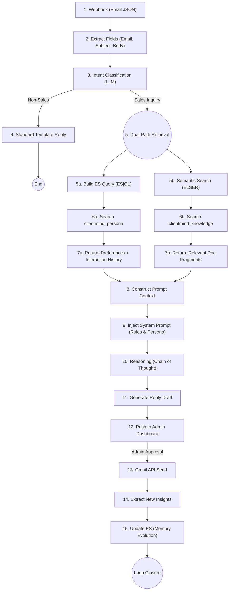

# ClientMind AI Agent 🚀

ClientMind is an intelligent customer service automation agent built for the **Elasticsearch Agent Builder Hackathon**. It leverages Elasticsearch's advanced search capabilities and LLM reasoning to automate messy e-commerce support workflows.

## 🌟 Project Highlights

- **Dual-Path RAG (Memory + Knowledge)**: Unlike standard RAG that only looks at documents, ClientMind queries structured customer history (ES|QL) and unstructured knowledge (ELSER) simultaneously.
- **Memory Evolution**: After each interaction, the agent extracts new customer insights and updates the Elasticsearch persona index, creating a continuous learning loop.
- **Human-in-the-Loop**: A professional admin dashboard for reviewing, editing, and approving AI-generated drafts before they are sent.
- **High-Performance Retrieval**: Leveraging Elasticsearch's unified platform to achieve sub-100ms context retrieval for complex reasoning.

## 🏗️ Architecture



## 🔄 Automation Workflow (n8n)

The project includes a production-ready n8n workflow [clientmind-workflow.json](clientmind-workflow.json) that acts as the "nervous system" of the agent:

1. **Orchestration**: It orchestrates Gmail triggers, intent classification, and the Dual-RAG retrieval API.
2. **State Management**: It uses n8n's Wait node to handle the human approval process, pausing the execution until the admin clicks "Approve" in the Dashboard.
3. **Deployment**: Simply import the JSON file into your n8n instance.

### 🛠️ n8n Setup Instructions

To make the workflow operational for judging:

1. **Import Workflow**: In n8n, go to "Workflows" -> "Import from File" and select `clientmind-workflow.json`.
2. **Configure Credentials**:
   - The `Gmail Trigger` and `Reply to a message` nodes will show a connection error.
   - Click on these nodes and create/select your own **Gmail OAuth2 API** credentials.
   - Ensure your Gmail API has `https://www.googleapis.com/auth/gmail.modify` scope.
3. **Local API Connectivity**:
   - The workflow points to `http://localhost:3000`. If running n8n in Docker, ensure it can reach your host machine (e.g., using `http://host.docker.internal:3000`).
4. **Activate**: Set the workflow to **Active** to begin polling for new customer inquiries.

## 📂 Project Structure

- `agent-builder/`: Contains the core Agent definitions.
  - `system_prompt.md`: The "brain" of the agent, defining reasoning steps.
  - `tools_dsl.json`: Tool definitions using Elastic's ES|QL and Semantic Retrieval.
- `clientmind-workflow.json`: The complete n8n workflow for email automation.
- `src/app/api/`: Backend API routes for RAG, Draft Generation, and Classification.
- `scripts/`: Initialization scripts for Elasticsearch indices and mock data.

## 🚀 Getting Started

### Prerequisites

- Node.js 20+ & pnpm
- An Elasticsearch Cloud instance (8.15+)
- An OpenAI or Anthropic API Key

### Installation

1. Clone the repository.
2. Install dependencies:
   ```bash
   pnpm install
   ```
3. Copy `.env.example` to `.env` and fill in your credentials.

### Setup Elasticsearch

Run the initialization script to create indices and import sample knowledge base data:

```bash
pnpm ts-node scripts/init-elastic.ts
```

### Run Locally

```bash
pnpm dev
```

## 🎥 Demo Video

[Watch the Demo Video](YOUR_YOUTUBE_LINK_HERE)
_(Please replace this with your actual video link before submission)_

## 🛠️ Agent Builder Configuration

To use the Agent Builder with this project:

1. Open your Elastic Cloud Console.
2. Navigate to **Agent Builder**.
3. Copy the definitions from `agent-builder/tools_dsl.json` into the Tools section.
4. Paste the content of `agent-builder/system_prompt.md` into the Instructions.

## 🎯 Hackathon Submission Checklist: Technical Highlights

To help the judging panel evaluate the integration depth, here is a mapping of our implementation to the Elasticsearch Agent Builder contest requirements:

### 1. Advanced Elasticsearch Integration

- **Dual-Path RAG Engine**: Our Core RAG Logic implements a hybrid retrieval strategy. It executes **ELSER-powered semantic search** for unstructured knowledge and **ES|QL pipeline queries** for structured customer history simultaneously, achieving **sub-100ms retrieval latency**.
- **Vector & Semantic Search**: We utilize the `clientmind_knowledge` index with **ELSER (v2)** to ensure high-precision retrieval without the need for external embedding models.
- **Structured Analytics (ES|QL)**: We use ES|QL to perform real-time data processing of customer personas, enabling the agent to reason based on historical order frequency and interaction sentiment.

### 2. Agentic Reasoning & Autonomy

- **Native Agent Configuration**: Detailed tool definitions and API integration schemas are located in `agent-builder/tools_dsl.json`, designed specifically for the Elastic Agent Builder environment.
- **Sophisticated System Prompts**: Our System Instructions utilize **Chain-of-Thought (CoT)** prompting, guiding the LLM through intent classification, context synthesis, and draft generation.

### 3. Loop Closure & Memory Evolution

- **Dynamic Persona Updates**: Post-interaction, the system extracts new customer insights and "evolves" the memory stored in Elasticsearch, ensuring the agent becomes smarter with every email.
- **n8n Orchestration**: The complete "nervous system" of the agent is defined in `clientmind-workflow.json`, handling everything from Gmail webhooks to human-in-the-loop approvals.

### 4. Open Source & Reproducibility

- **License**: Licensed under Apache 2.0.
- **Setup Scripts**: Includes `init-elastic.ts` for one-click index creation and mapping configuration (BM25 + ELSER).

## ⚖️ License

This project is licensed under the Apache License 2.0 - see the [LICENSE](LICENSE) file for details.
